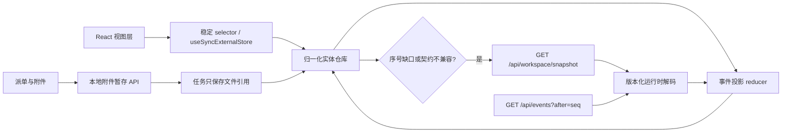

# AI 前端题库驱动的玉兔6升级总计划

- 状态：待按阶段触发
- 制定日期：2026-07-17
- 升级对象：`projects/控制台/frontend/`、必要的 `projects/控制台/server.js` API 适配层
- 参考知识库：`/Users/yutu6/Documents/参考知识库/AI前端设计面试题库-2026/`

## 1. 目标与边界

本计划把飞书 Wiki 的 8 章、144 道 AI 前端题转译为玉兔6可验证、可回滚的工程升级，不把面试题中的所有技术机械搬进系统。

目标：

1. 让 React 工作区从“定时拉全量 JSON”升级为“启动快照 + 增量事件 + 可恢复同步”。
2. 建立前后端可校验的数据契约，减少模型、队列和任务状态变化造成的运行时崩溃。
3. 降低空闲轮询、重复 JSON 解析、无效重渲染和大附件 Base64 带来的内存与 CPU 占用。
4. 把任务过程呈现为可核实的状态、工具、证据、产物和失败原因，而不是展示或保存模型的私密思维链。
5. 保留现有 `/api/*` 合同、Node 后端零运行时依赖和已认可的等距办公室素材。
6. 每阶段独立验收、独立回滚；新版稳定前，旧版继续保留在 `/workspace-legacy`。

本轮只建立知识库和升级计划，不修改生产运行逻辑。

## 2. 来源与现状基线

### 2.1 题库范围

| 章节 | 题数 | 对玉兔6最直接的启发 |
|---|---:|---|
| TypeScript 与类型系统 | 20 | API 版本、状态联合类型、工具参数与响应校验 |
| 流式处理与实时通信 | 25 | NDJSON/SSE、断线重连、背压、顺序与去重 |
| 前端状态管理与数据流 | 21 | 归一化实体、事件投影、派生状态、持久化边界 |
| 性能优化与渲染 | 20 | 列表窗口化、渲染隔离、分包、内存监控 |
| 前端 AI 架构设计 | 19 | 模型路由、任务编排、工具执行、RAG 与可观测性 |
| AI 特性与前端工程实践 | 14 | 流式 UX、取消/重试、反馈、安全和容错 |
| AI 工程化与前端工具链 | 18 | 测试分层、契约、监控、发布与回滚 |
| 大模型前端集成 | 7 | 多模型抽象、成本/用量、降级与错误呈现 |

### 2.2 当前实现

- React 18 + TypeScript + Vite 已位于 `projects/控制台/frontend/`，构建产物进入 `public/app/`。
- Node 服务继续零第三方运行时依赖；`/workspace-next` 指向 React 预览，旧页保留。
- React 当前每 2.5 秒请求 runners、queues overview、CEO task board、version，每 10 秒请求 bulletin。
- 当前页面可见时一次核心轮询约 254KB，公告板约 186KB，合计约 7.2MB/分钟的重复本地 JSON 传输与解析。
- `TaskBoard` 每秒更新 `now`，带动整块任务板重新执行渲染。
- 任务列表有 `content-visibility`，但没有真正的窗口化。
- API 客户端把 JSON 直接断言为 TypeScript 类型，没有运行时解码、契约版本或缺字段降级。
- 图片附件上限为 6 张、每张 10MB，并转为 Data URL 写入任务请求；会产生约 33% Base64 膨胀和多份内存副本。
- 后端和旧工作区已经具备 `/api/events?after=<seq>` 增量游标，旧页还有批量进度更新和渲染签名去重，可直接复用成熟逻辑。
- 2026-07-17 采样时控制台 Node RSS 约 160MB；多 worker/runner 才是系统总内存的更大来源，因此前端优化不能替代进程并发治理。

### 2.3 目标预算

| 指标 | 当前基线 | 第一阶段目标 |
|---|---:|---:|
| 可见页面空闲网络解析量 | 约 7.2MB/分钟 | 启动后不超过 200KB/分钟 |
| 正常任务活跃期增量流量 | 全量轮询 | 不超过 1MB/分钟，且与真实事件量相关 |
| 任务板定时刷新 | 整板每秒 | 只更新可见时钟/变更实体 |
| 断线恢复 | 下次全量轮询碰运气 | 按 `lastSeq` 补齐；发现缺口时自动重取快照 |
| 前端 30 分钟稳定性 | 未设预算 | heap 不持续单调增长超过 20MB |
| 服务端改造额外 RSS | 未设预算 | 相对基线增加不超过 30MB |

## 3. 目标架构



核心原则：

- 快照只负责冷启动和失步恢复，事件负责持续更新。
- 服务端保持内置 Node 能力，不引入生产运行时依赖。
- 客户端用明确事件和状态联合类型，不用自由字符串猜状态。
- UI 只订阅自己需要的实体；计时器、进度和大列表彼此隔离。
- 原始私密思维链不进入产品；保留结构化的“决策摘要、工具调用、证据、产物、失败原因”。

## 4. 数据协议草案

### 4.1 工作区快照

```ts
interface WorkspaceSnapshotV1 {
  schemaVersion: 1;
  revision: string;
  lastSeq: number;
  generatedAt: string;
  runners: RunnerSummary[];
  queues: QueueSummary[];
  tasks: TaskSummary[];
  bulletin: BulletinCard[];
  version: VersionSummary;
}
```

服务端可新增 `/api/workspace/snapshot`，但原有 `/api/runners`、`/api/queues/overview`、`/api/task-board/ceo`、`/api/bulletin` 和 `/api/version` 保持兼容。

### 4.2 增量事件

```ts
type WorkspaceEventV1 =
  | { type: 'task.upsert'; seq: number; task: TaskSummary }
  | { type: 'task.remove'; seq: number; taskId: string }
  | { type: 'queue.upsert'; seq: number; queue: QueueSummary }
  | { type: 'runner.upsert'; seq: number; runner: RunnerSummary }
  | { type: 'bulletin.upsert'; seq: number; card: BulletinCard }
  | { type: 'bulletin.remove'; seq: number; cardId: string }
  | { type: 'workspace.resync_required'; seq: number; reason: string };
```

客户端必须处理：

- 重复事件：按 `seq + entity id` 幂等。
- 乱序事件：短窗口重排；无法修复时重取快照。
- 丢失事件：检测 `seq` 缺口并自动 resync。
- 后台/睡眠恢复：先补游标，超出保留窗口再重取快照。
- 未知事件：记录一次兼容告警并忽略，不能让整页崩溃。

## 5. 分阶段升级任务

以下每一项都可以作为下一次独立触发指令。默认由秘书接收、CEO 决定执行路线，再交对应主管和程序员；维修类故障仍走维修部门。

### AI-FE-01：建立版本化前端契约

**触发语：** `执行 AI-FE-01 前端契约升级`

范围：

- 新建 `frontend/src/contracts/`。
- 为 runners、queue、task board、bulletin、version 和 events 建立运行时解码器。
- 把 task/node/runner 状态改成可穷举联合类型。
- 增加 `schemaVersion` 和未知字段兼容策略。
- 不修改现有 API 路径。

验收：

- 合法响应通过；缺必填字段、错误状态和不兼容版本能给出明确错误。
- 单个 API 解码失败只降级对应模块，页面壳和派单框仍可用。
- TypeScript typecheck 和契约测试通过。

回滚：删除 contracts 层并恢复现有 `requestJson<T>` 调用。

### AI-FE-02：合并启动快照并建立 revision

**触发语：** `执行 AI-FE-02 工作区快照`

范围：

- 新增 `/api/workspace/snapshot` 聚合现有只读数据。
- 输出 `schemaVersion/revision/lastSeq/generatedAt`。
- 支持 `ETag`/`If-None-Match` 或等价 revision 判断。
- 保留全部旧 API。

验收：

- 快照内容与五个旧接口语义一致。
- 无变化时返回 304 或轻量 unchanged 结果。
- 单次未压缩响应目标不超过 220KB；超预算要给出字段占比。
- 后端 RSS 增量不超过 30MB。

回滚：前端退回旧接口，删除聚合路由，不影响旧页。

### AI-FE-03：增量事件仓库与可靠重连

**触发语：** `执行 AI-FE-03 增量事件数据层`

范围：

- 先复用已有 `/api/events?after=<seq>`，不急于引入 WebSocket。
- 建立归一化 task/queue/runner/bulletin store 和纯 reducer。
- 增加游标持久化、去重、缺口检测、重连退避、后台恢复和快照重同步。
- 若长轮询仍有明显延迟，再用 Node 原生能力增加 SSE；两者协议共用。

验收：

- 断网 30 秒后恢复，任务状态不重复、不倒退、不丢失。
- 重放相同事件结果幂等。
- 人为制造序号缺口会自动重取快照。
- 空闲解析量降到 200KB/分钟以内。

回滚：保留新 store，切回定时快照刷新。

### AI-FE-04：渲染隔离与任务列表窗口化

**触发语：** `执行 AI-FE-04 React 渲染性能`

范围：

- 把 1 秒时钟从 `TaskBoard` 拆到可见的时间标签。
- 对任务卡、节点链和计数使用稳定 selector 与 memo。
- 对进行中/队列/历史列表做轻量窗口化，不引入后端依赖。
- 保持展开详情、滚动位置、右键菜单和批量操作。

验收：

- 100、500、1000 条模拟任务下可滚动、标题完整、展开不跳位。
- 无事件时任务卡不发生整板 commit。
- 低性能模式下交互无明显掉帧。
- 视觉截图与功能回归通过。

回滚：切换 feature flag 使用旧列表组件。

### AI-FE-05：附件暂存与引用化

**触发语：** `执行 AI-FE-05 附件引用化`

范围：

- 新增仅本机可用的附件暂存 API。
- 图片以文件流写入受控目录，任务 JSON 只保存 id、相对路径、MIME、尺寸、hash。
- 保留 6 张/每张 10MB 限制，增加过期清理和任务完成后的保留策略。
- 拒绝路径穿越、伪造 MIME 和超限内容。

验收：

- 6 张 10MB 图片派单时不再生成大 Data URL 请求。
- 刷新后草稿与预览可恢复，任务能读取附件。
- 清理脚本不会删除仍被 queued/running 任务引用的文件。

回滚：保留旧 Base64 提交能力一个版本，通过配置切换。

### AI-FE-06：按业务域重组 React 工程

**触发语：** `执行 AI-FE-06 前端模块化`

范围：

- 按 `workspace/tasks/bulletin/office/flow/settings/gateway` 划分 feature。
- 建统一 ErrorBoundary、加载态、空态、过期态和权限错误态。
- 路由和重视图按需加载，基础工作区不加载办公室/办公楼大资产。
- design tokens 继续单一来源。

验收：

- 首屏只加载派单、任务板和必要数据。
- 任一懒加载模块失败不拖垮全页。
- 生产 build 无循环依赖和重复大 chunk。

回滚：保留 `App.tsx` 旧入口和构建产物快照。

### AI-FE-07：迁移办公室与办公楼

**触发语：** `执行 AI-FE-07 办公室办公楼迁移`

范围：

- 保留已认可像素资产和 `image-rendering: pixelated`。
- 办公楼从 iframe 迁为 React 路由/组件。
- Base64 GIF 改为静态文件引用。
- 资产按视图懒加载，离开视图后停止动画计时器。

验收：

- 办公室工位状态、角色位置和办公楼三段动画与旧页一致。
- 视图切换无白屏，离开页面后 CPU/内存不持续增加。
- Peekaboo 或浏览器截图对照通过。

回滚：路由回指旧 iframe/旧视图。

### AI-FE-08：迁移工位与链路图

**触发语：** `执行 AI-FE-08 工位链路图迁移`

范围：

- 复用统一 task/agent store，不再各视图单独解析全量事件。
- 节点定位和边线计算与数据更新分离。
- 大图只渲染可见区域，缩放/拖动不触发全局重排。
- 保留真实状态，不用历史失败回填当前空闲状态。

验收：

- 23+ 工位和复杂链路下缩放、拖动、切换流畅。
- 节点无重叠、连线有间距、任务状态与任务板一致。
- 事件到 UI 的延迟可观测且小于 1 秒。

回滚：保留旧工位/链路图入口。

### AI-FE-09：AI 任务详情与结构化执行轨迹

**触发语：** `执行 AI-FE-09 AI 任务详情`

范围：

- 统一呈现 goal、acceptance、模型/runner、工具调用、证据、产物、失败原因和重试。
- 流式输出支持暂停自动滚动、继续、取消和复制。
- 不展示或持久化模型私密思维链；只展示可审计的结构化摘要。
- 证据引用能打开本地文件或对应任务产物。

验收：

- 用户能在一个详情页判断“任务目的、当前步骤、谁在做、产物在哪、为什么失败”。
- 取消/重试状态不会与后端真实状态冲突。
- 长日志不导致 DOM 无界增长。

回滚：详情入口回到现有折叠区。

### AI-FE-10：模型、Token、成本与降级可观测性

**触发语：** `执行 AI-FE-10 模型用量可观测`

范围：

- 展示 runner/model/provider、输入/输出 token、耗时、重试和估算成本。
- 区分 CLI 订阅、new-api 计量和无法计量的调用，禁止伪造统一口径。
- 将熔断、降级、董事缺席和 fallback 原因结构化呈现。
- 所有 token/key 只在服务端，本页不接触密钥。

验收：

- 单任务、单模型、时间窗口三个维度可核对。
- 数据缺失明确显示“未计量”，不能显示为 0。
- 不增加新的高频模型健康探测。

回滚：隐藏新面板，不影响调度。

### AI-FE-11：迁移控制室与 API 网关

**触发语：** `执行 AI-FE-11 控制室网关迁移`

范围：

- 将 control-room 和 api-gateway 纳入同一 React 壳、tokens 和路由。
- 保留 new-api 本机直达、渠道/令牌/日志/模型入口。
- 统计请求复用共享缓存，切换页面不重复拉取。

验收：

- 原有探测、聊天、历史、渠道概览和跳转均可用。
- 页面切换后无重复 interval、listener 或未取消 fetch。
- API 合同不变。

回滚：链接恢复到旧静态页。

### AI-FE-12：精简前端质量门与可观测预算

**触发语：** `执行 AI-FE-12 前端质量门瘦身`

范围：

- 快门：typecheck、契约测试、reducer 测试、变更组件测试。
- UI 变更才触发视觉截图；非 UI 变更不跑重型视觉门。
- 全量端到端、长稳测试、内存趋势和跨视图截图放到夜间/发布门。
- 每个门记录它防止的历史问题、成本和休眠条件。

验收：

- 普通小改的本地快门目标 2 分钟内结束。
- 已知关键回归仍能被对应测试拦截。
- 无历史问题依据、无明确收益的重门默认休眠。

回滚：恢复当前测试入口；测试文件不删除。

### AI-FE-13：灰度切换与旧页退役

**触发语：** `执行 AI-FE-13 React 工作区切换`

前提：AI-FE-01 至 AI-FE-12 中与生产功能有关的验收均已通过，且主人确认截图和实际操作。

范围：

- `/workspace` 切到 React。
- `/workspace-legacy` 至少保留一个稳定版本周期。
- 记录版本、构建 hash、回滚路径和运行基线。
- 稳定期后再删除旧页，不在同一任务中仓促清理。

验收：

- 派单、图片、队列、公告板、办公室、办公楼、工位、链路图、设置、控制室和 API 网关全通过。
- 运行 8 小时无内存持续增长、无事件失步、无旧页独有功能缺失。
- 一条命令可回滚到 legacy。

## 6. 推荐执行顺序

```text
AI-FE-01 契约
  -> AI-FE-02 快照
  -> AI-FE-03 增量事件
  -> AI-FE-04 渲染性能
  -> AI-FE-05 附件引用
  -> AI-FE-06 模块化
  -> AI-FE-07 办公室/办公楼
  -> AI-FE-08 工位/链路图
  -> AI-FE-09 AI 任务详情
  -> AI-FE-10 用量可观测
  -> AI-FE-11 控制室/API 网关
  -> AI-FE-12 质量门瘦身
  -> AI-FE-13 灰度切换
```

前四项是最高收益的地基，应先于大规模视觉迁移。AI-FE-05 可在 AI-FE-03 后与 AI-FE-04 并行，但同一文件有冲突时仍需编辑锁。

## 7. 暂不采用的题库方案

以下内容不是不好，而是当前没有足够收益：

- 微前端/Module Federation：当前只有一个本机控制台，会增加构建和契约复杂度。
- CRDT 多人协同：当前文件队列和单主人决策不需要多人实时编辑。
- WebRTC、WebGPU、WASM：没有对应的真实瓶颈或产品需求。
- 浏览器直接调用模型 API：会扩大密钥暴露面，继续由本机服务端代理。
- 为“更智能”而保存完整思维链：改为保存可审计的结构化过程和证据。
- 为每个问题增加重型 gate：继续按真实事故和风险分层，避免速度与 token 被审查本身吞掉。

## 8. 需要主人拍板的节点

当前不需要先拍板即可开始 AI-FE-01。

后续只在以下节点请主人确认：

1. AI-FE-05：附件完成后保留多久，以及是否允许手动永久保留。
2. AI-FE-09：结构化任务轨迹默认展开到什么详细程度。
3. AI-FE-13：何时把 `/workspace` 正式切到 React，以及 legacy 保留周期。

## 9. 下一步

建议下一条任务直接发送：

> 执行 AI-FE-01 前端契约升级，按总计划完成实现、测试和回滚验证。

## 10. 执行记录（2026-07-17）

AI-FE-01 至 AI-FE-13 已按依赖顺序执行。生产默认入口已切换到 React，经典页继续保留。

| 阶段 | 状态 | 主要证据 |
|---|---|---|
| AI-FE-01 至 05 | 完成 | contract、snapshot、event store、virtual list、attachment staging 测试 |
| AI-FE-06 至 08 | 完成 | feature 边界、懒加载、办公室/办公楼/工位/链路图截图 |
| AI-FE-09 至 11 | 完成 | 任务详情、模型用量、控制室与 API 网关专项测试和截图 |
| AI-FE-12 | 完成 | 快门 6.145 秒；发布门 7.025 秒 |
| AI-FE-13 | 已切换，长稳观察中 | `/workspace`=React；`/workspace-legacy` 保留；一键回滚已实测；8 小时 launchd 金丝雀运行中 |

完整总结：`projects/控制台/artifacts/ai-fe-upgrade/AI前端知识库优化总结-20260717.md`
